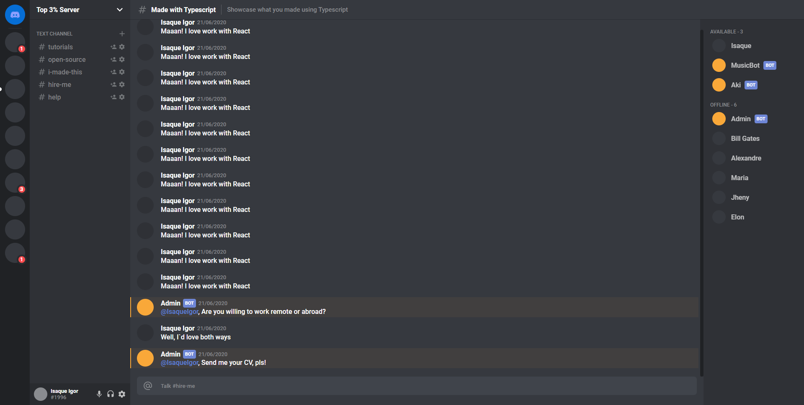

<h1 align="center">
    
</h1>

  

  

  

  

  <a href="#-project">Project</a>&nbsp;&nbsp;&nbsp;|&nbsp;&nbsp;&nbsp;
  <a href="#rocket-Technologies">Technologies</a>&nbsp;&nbsp;&nbsp;|&nbsp;&nbsp;&nbsp;
  <a href="#-layout">Layout</a>&nbsp;&nbsp;&nbsp;|&nbsp;&nbsp;&nbsp;
  <a href="#-how-to-contribute">How to contribute</a>&nbsp;&nbsp;&nbsp;|&nbsp;&nbsp;&nbsp;

## 💻 Project

Discord is a proprietary freeware VoIP application and digital distribution platform designed for creating communities ranging from gamers to education and businesses.
this project was built aiming to develop skills in the following technologies.

## :rocket: Technologies

This project was developed with the following technologies:

- [React][reactjs]
- [Typescript][typescript]
- [CSS Grid][css]

## 🔖 Layout

    
    

## 🤔 How to contribute

- Make a fork;
- Create a branck with your feature: `git checkout -b my-feature`;
- Commit changes: `git commit -m 'feat: My new feature'`;
- Make a push to your branch: `git push origin my-feature`.

After merging your receipt request to done, you can delete a branch from yours.

## :memo: License

This project is under the MIT license. See the [LICENSE](LICENSE.md) for details.

Made with ♥ by Isaque Igor :wave: [Get in touch!](https://www.linkedin.com/in/isaqueigor/)

[reactjs]: https://reactjs.org
[typescript]: https://www.typescriptlang.org/
[css]: https://learncssgrid.com/
